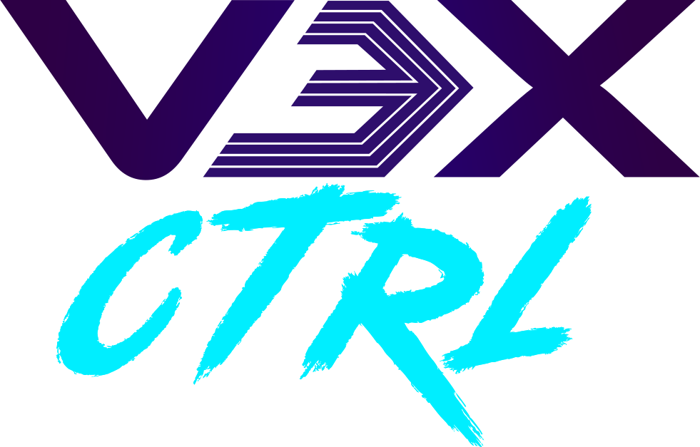

# V3XCTRL
### Video eXchange and ConTRoL - /vɛks kənˈtɹoʊl/

   
  
    

> Control your vehicle and stream video over 4G from anywhere.

This project provides a platform to stream video and control servos via a 4G mobile connection using low cost, off the shelf hardware with minimal latency.

The documentation is split into multiple files:

- [Quickstart Guide in the wiki](https://wiki.v3xctrl.com/) - get things set up
- [Terminology](https://wiki.v3xctrl.com/Terminology/) - read this to understand the terminology of the project
- [Recommended Hardware](https://wiki.v3xctrl.com/Hardware/) - Which hardware you are going to need
- [Streamer Setup](https://wiki.v3xctrl.com/Streamer/) - How to set up your hardware (the streamer)
- [Motivation](https://wiki.v3xctrl.com/Motivation/) - If you want to understand why things are implemented as they are, this document should help you
- [Troubleshooting](https://wiki.v3xctrl.com/Troubleshooting/) - read this before opening issues, your problem might have already been solved
- [Latency Breakdown](https://wiki.v3xctrl.com/Latency/) - how much latency is there and where does it come from?

## Support

Make sure to check the [Troubleshooting Guide](https://github.com/stylesuxx/v3xctrl/wiki/Troubleshooting) first, your problem might have already been solved.

If you need any help feel free to open an [issue here](https://github.com/stylesuxx/v3xctrl/issues), or even better, join us on [Discord](https://discord.gg/uF4hf8UBBW).

## Quickstart

Follow the [Quickstart Guide in the wiki](https://github.com/stylesuxx/v3xctrl/wiki/Quickstart) to get you going.

## Development

Check the following documentation if you are interested in contributing to the project:

- [Development](https://wiki.v3xctrl.com/Development/) - how to setup your development environment
- [Release](https://wiki.v3xctrl.com/x-Release/) - how to release a new version of the project

### Contributing

PR's are welcome, please direct them against the develop branch. Before investing a lot of time into a new feature, feel free to discuss with us beforehand, we might have some pointers for you.

Feel free to open issues if you have any questions, problems or suggestions.
